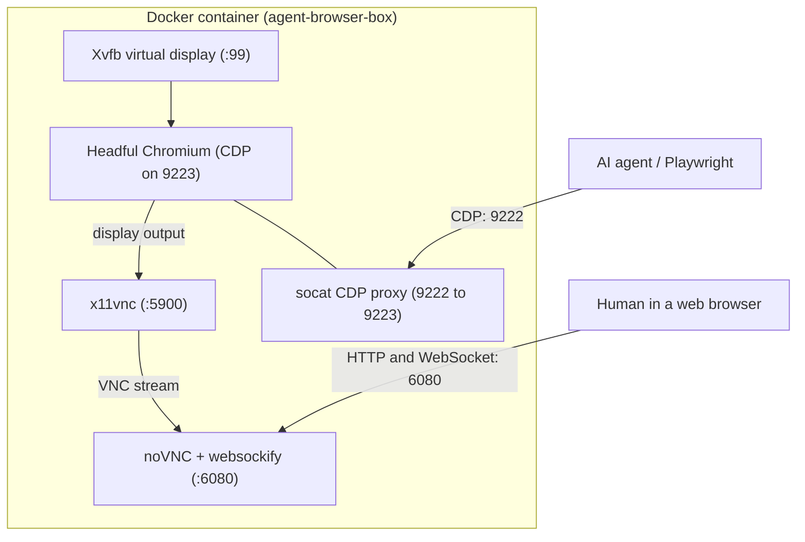

# Agent Browser Box

A Dockerized headful Chromium browser controlled via CDP with a live web viewer for human interaction.

## Overview

Automating web tasks with AI agents often fails when encountering logins, CAPTCHAs, 2FA, or unexpected UI modals.

Agent Browser Box runs headful Chromium inside a container. AI agents control the browser over Chrome DevTools Protocol (CDP). Humans can watch the browser session live through noVNC on port 6080 and step in when manual input is needed. The agent and human interact with the same browser instance, maintaining session state.

## Benefits

- Uninterrupted execution: Humans can solve CAPTCHAs or logins without restarting the agent task.
- Credentials privacy: Sensitive passwords and 2FA tokens are entered directly by humans instead of being sent to LLMs.
- Anti-detection: Uses headful Chromium inside a virtual display instead of headless mode.
- Remote viewing: Accessible from any desktop or mobile web browser.

## Quick Start

### Option 1: Standalone Container (Published Image)

Run the container directly using `docker run`:

```bash
# Pull published image from Docker Hub
docker pull suhailtaj/agent-browser-box:latest

# Run standalone container
docker run -d --shm-size=2gb --cap-add=SYS_ADMIN -p 9222:9222 -p 6080:6080 --name agent-browser-box suhailtaj/agent-browser-box:latest
```

### Option 2: Local Development & Build from Source (Docker Compose)

Build and run locally from the repository source:

```bash
docker compose up -d --build
```

### Verify Readiness

Once running via either option, check the CDP endpoint:

```bash
curl http://localhost:9222/json/version
```

## Endpoints

| Endpoint | Audience | Description |
|---|---|---|
| `http://localhost:9222` | AI Agents | Chrome DevTools Protocol (CDP) endpoint for Playwright / Puppeteer. |
| `http://localhost:6080/` | Humans | Live browser stream over noVNC. |

## AI Agent Integration

Connect an agent using Python and Playwright ([`examples/stealth_agent.py`](examples/stealth_agent.py)):

```bash
pip install playwright
python examples/stealth_agent.py
```

```python
from playwright.sync_api import sync_playwright

with sync_playwright() as p:
    browser = p.chromium.connect_over_cdp("http://localhost:9222")
    page = browser.contexts[0].pages[0]

    page.goto("https://example.com")
    print("Agent is driving page:", page.title())
```

## How it works



Agent Browser Box supervises four core processes inside a single container using `supervisord`:

1. **Xvfb** creates a virtual X11 display (`:99`) at `1280x800`.
2. **Headful Chromium** renders directly onto `:99` and listens on internal CDP port `9223`.
3. **socat CDP Proxy** bridges CDP port `9222` to internal port `9223`, allowing external agent connections.
4. **x11vnc & noVNC + websockify** capture display (`:99`) and stream it over WebSockets on port `6080`.

### System Process Map
```
+-------------------------------------------------------------------------+
|                       agent-browser-box container                       |
|                                                                         |
|  +--------------+        +-------------------+                          |
|  |  Xvfb (:99)  | ------>| Chromium (headful)| <=== CDP:9222 === AI Agent
|  +--------------+        +---------+---------+                          |
|                                    |                                    |
|                             (Display Output)                            |
|                                    v                                    |
|                          +-------------------+                          |
|                          |   x11vnc (:5900)  |                          |
|                          +---------+---------+                          |
|                                    |                                    |
|                              (VNC Stream)                               |
|                                    v                                    |
|                          +-------------------+                          |
|                          | noVNC + websockify| <=== HTTP:6080 === Human |
|                          +-------------------+                Observer  |
+-------------------------------------------------------------------------+
```

Human actions performed at `http://localhost:6080/` happen in the exact same browser session the AI agent is driving, so cookies, authentication tokens, and session states persist automatically.

## Security

Chromium runs as the unprivileged `sandboxuser` account with Chromium's real
user-namespace sandbox enabled. It is **not** launched with `--no-sandbox`.

Docker's default seccomp profile blocks the unprivileged user-namespace call
Chromium needs on Docker Desktop, even when the host kernel has user namespaces
enabled. The container therefore receives only the `SYS_ADMIN` capability.
`SYS_ADMIN` is security-sensitive and expands what a compromised process could
do inside the container, so keep the container otherwise unprivileged, do not
mount sensitive host paths, and do not replace it with `--privileged`. On a
runtime whose security profile permits unprivileged user namespaces, you may
remove `cap_add: SYS_ADMIN` after confirming Chromium starts successfully.

The Chromium profile lives only in the container's writable layer. No profile
volume is created or mounted, so removing the container removes all browser
state.

## Project Structure

```
agent-browser-box/
├── Dockerfile              # Container definition (Debian + Chromium + noVNC)
├── docker-compose.yml      # Service port mappings and security settings
├── supervisord.conf        # Internal process supervisor
├── examples/
│   └── stealth_agent.py    # Python stealth agent with CAPTCHA detection
└── viewer/
    └── index.html          # Responsive mobile & desktop live viewer
```

## License

[MIT License](LICENSE)
